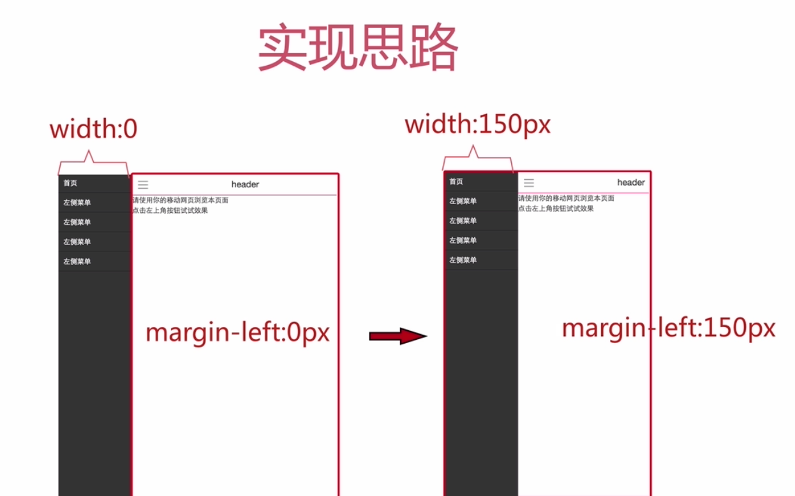

# jquery-left-navigator
jquery实现的左侧导航

### 实现原理
 <br>

### 总结
1.用实现三道杠 <br>
css代码

```
  .header .btn-slide-bar {
    float: left;
    width: 46px;
    height: 46px;
    cursor: pointer;
    line-height: 46px;
}

.header .btn-slide-bar:before {
    content: '';
    width: 20px;
    height: 2px;
    background-color: #999;
    display: inline-block;
    box-shadow: 0 7px 0 #999, 0 -7px 0 #999; 
}

```

2. 盒阴影的参数问题 <br>
     ```box-shadow: 0 7px 0 #999, 0 -7px 0 #999; /* 参数的含义  向右向下为正 前俩个是水平和垂直偏移  第三个是模糊   */```


### 实际效果
[戳我](https://kuronekonyaa.github.io/jquery-left-navigator/)
